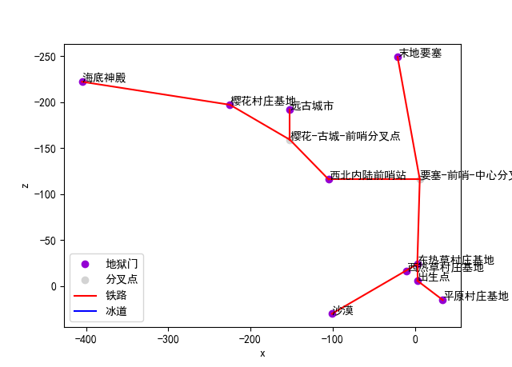

# 地狱交通绘图仪

服务器地狱交通太复杂，绕得人发昏？你可以用图来表示！

## 作者

[MC着火的冰块](https://space.bilibili.com/551409211)

## 成果展示



## 特点

- 支持将数据存储至本地并读取
- 节点类型
    - 地狱门
    - 分叉点
- 线路类型
    - 铁路
    - 冰道
- 添加和删除节点/线路
- 实时显示图像
- 标注节点名字
- 清晰的图例
- z 轴反转（即上北下南左西右东）

## 使用

1. 在游戏里记录地狱里每个地狱门和分叉点的 x 和 z 坐标，并给它们起个有意义的名字
2. 记录哪些节点被什么类型的线路连接了
3. `NetherTrafficPlotter`，启动！
4. 输入数据（或在`文件 - 打开`恢复之前的数据）：
    - 添加节点：需要准确输入节点类型、x、z、名字
    - 删除节点：选中节点名字，点击删除即可。删除节点时，会一并删除连接在节点上的线路
    - 添加线路：需要准确输入线路类型和两端的节点
    - 删除线路：选中两个节点即可，顺序随意
5. 在`文件 - 保存`保存数据至本地，方便以后再使用
6. 保存图像

## 从源代码运行

开发时用的`Python`版本：3.11

你需要`requirements.txt`里的所有库。如果你要修改ui，那么还要再安装`pyqt5-tools`。用以下命令一次安装它们：

```commandline
pip install -r requirements.txt pyqt5-tools -i https://pypi.tuna.tsinghua.edu.cn/simple
```

### 修改ui

不要直接修改`ui_ntp.py`：

```python
# Form implementation generated from reading ui file 'ui_ntp.ui'
#
# Created by: PyQt5 UI code generator 5.15.9
#
# WARNING: Any manual changes made to this file will be lost when pyuic5 is
# run again.  Do not edit this file unless you know what you are doing.
```

你应该用`designer`打开`ui_ntp.ui`，完成修改后：

```commandline
pyuic5 ui_ntp.ui -o ui_ntp.py
```
